<div align="center">

# ⚛️ SimQC

### A browser-based quantum circuit simulator with stepwise inspection and AI-assisted explanation

Built from first principles in JavaScript. No quantum hardware. No Qiskit, Cirq or PennyLane. No server.


</div>

---

## 📖 Table of contents

1. [What is SimQC?](#-what-is-simqc)
2. [Project status](#-project-status)
3. [Why this project exists](#-why-this-project-exists)
4. [Features](#-features)
5. [How it works](#-how-it-works)
6. [Architecture](#-architecture)
7. [Gate library](#-gate-library)
8. [Algorithms](#-algorithms)
9. [Getting started](#-getting-started)
10. [Repository structure](#-repository-structure)
11. [Validation and testing](#-validation-and-testing)
12. [Roadmap](#-roadmap)
13. [Scope and limitations](#-scope-and-limitations)
14. [Related work](#-related-work)
15. [Team](#-team)
16. [References](#-references)
17. [License](#-license)

---

## 🔬 What is SimQC?

SimQC simulates the circuit operations of a quantum computer entirely in the browser. A quantum state of `n` qubits is stored as a vector of `2ⁿ` complex amplitudes, and every gate is applied as a matrix operation on that vector. The project is implemented from scratch: it depends on no quantum SDK and no server-side runtime.

The goal is a simulator that is **numerically correct**, **efficient**, and **inspectable**: a user should be able to see not only the final measurement of a circuit but also how it got there.

> **Note:** This repository is at the **proposal stage** (CSE 299). The sections below describe the design and the intended deliverables. The [Project status](#-project-status) table shows what is committed and what is only proposed.

---

## 🚦 Project status

| Component | Commitment | Status |
|---|---|---|
| Complex arithmetic and `n`-qubit state vector | Committed | ⬜ Planned |
| Gate library (X, Y, Z, H, CNOT, Rx, Ry, Rz) | Committed | ⬜ Planned |
| Gate application on target qubits only | Committed | ⬜ Planned |
| Measurement and repeated-shot sampling | Committed | ⬜ Planned |
| At least three of Deutsch–Jozsa, Grover, QFT | Committed | ⬜ Planned |
| Custom drag-and-drop circuit editor | Committed | ⬜ Planned |
| State displays (probabilities, amplitudes, state-vector text, histogram) | Committed | ⬜ Planned |
| Extended gates (I, S, T, CZ, SWAP, Toffoli) | Extension | ⬜ Planned |
| JSON and URL persistence | Planned | ⬜ Planned |
| Breakpoints and stepwise inspection | Proposed feature | ⬜ Planned |
| Reusable circuit blocks | Proposed feature | ⬜ Planned |
| Entanglement highlighting | Proposed feature | ⬜ Planned |
| Explainer AI and builder AI | Proposed feature | ⬜ Planned |
| Bloch sphere and density-matrix displays | Deferred | ⬜ Later |

*Update this table as work lands: ⬜ Planned → 🟨 In progress → ✅ Done.*

---

## 🎯 Why this project exists

The evolution of a small quantum system under a short sequence of gates can be reasoned about, and computed, by hand. As the number of qubits grows, the state dimension grows exponentially, and multi-qubit behaviour becomes hard to understand and verify:

| Qubits | Amplitudes in the state |
|---:|---:|
| 1 | 2 |
| 3 | 8 |
| 10 | 1,024 |
| 20 | 1,048,576 |
| 24 | 16,777,216 |

Entanglement, and the interference patterns behind algorithms such as Grover's search and the Quantum Fourier Transform, are difficult to verify by inspection at this scale.

SimQC addresses this by providing:

1. an explicit, numerically correct representation of multi-qubit states,
2. efficient gate application that never builds the full `2ⁿ × 2ⁿ` matrix,
3. verified implementations of canonical quantum algorithms, and
4. tools for seeing *how* a circuit produces its result.

It is also a learning project: the team is implementing quantum circuits and algorithms from the ground up in order to understand them in depth.

---

## ✨ Features

### Core (committed)

- **Explicit state vectors** of complex amplitudes, with normalization enforced after every gate.
- **Targeted gate application:** a gate updates only the amplitudes it affects.
- **Measurement** by repeated-shot sampling with state collapse.
- **Canonical algorithms** built on the public simulator interface, with at least three of Deutsch–Jozsa, Grover and QFT.
- **Custom drag-and-drop editor** that drives the simulation core.
- **Browser-only:** open a page and use it. No installation of a quantum SDK, no backend.

### Proposed (aimed for, not guaranteed)

- 🔴 **Breakpoint-based stepwise inspection:** pause the simulation at a chosen column and examine the state.
- 🧩 **Reusable circuit blocks:** save a subcircuit and use it as a single block. While paused, select a subcircuit or place a breakpoint inside it to see how those gates transform their current input.
- 🌈 **Entanglement highlighting:** distinct visual cues for qubits whose joint state is entangled.
- 🤖 **AI module:**
  - *Explainer:* turns a circuit into a textual description.
  - *Builder:* turns a textual description into a circuit.
  - *Input/output analysis:* the AI sees the flattened (fully expanded) circuit. The user selects input lines and output lines. Each input is analysed first, then how the results combine into the selected outputs.

> Quirk already displays the state after every circuit column. SimQC's intended distinction is a **breakpoint-driven, debugger-style** interaction model together with subcircuit inspection. No claim of priority is made.

---

## 🧮 How it works

### 1. The state is a list of amplitudes

An `n`-qubit pure state is

$$
|\psi\rangle = \sum_{i=0}^{2^n-1} \alpha_i\,|i\rangle ,\qquad \sum_{i=0}^{2^n-1} |\alpha_i|^2 = 1 ,
$$

where each $\alpha_i \in \mathbb{C}$. Think of a scoreboard with one row per bit string, each row holding a complex number.

### 2. A gate rewrites the list

Evolution under a gate is a unitary update:

$$
|\psi_{k+1}\rangle = U_k\,|\psi_k\rangle .
$$

For example, the Hadamard gate takes $|0\rangle$ to $\tfrac{1}{\sqrt2}(|0\rangle + |1\rangle)$. Applying it a second time returns the state to $|0\rangle$, because the two contributions to $|1\rangle$ cancel. Amplitudes can cancel; probabilities cannot. Grover's search and the QFT depend on this effect.

### 3. The efficiency technique: update pairs, not matrices

The textbook method lifts a single-qubit gate $G$ to the full operator

$$
U_t = \underbrace{I \otimes \cdots \otimes I}_{t} \otimes\, G \otimes \underbrace{I \otimes \cdots \otimes I}_{n-1-t}
$$

and multiplies it with the state. That materializes a $2^n \times 2^n$ matrix and costs $O(4^n)$.

SimQC never builds $U_t$. A gate on qubit $t$ only mixes amplitudes whose indices differ in bit $t$, that is, index pairs $(i,\; i \oplus 2^t)$:

$$
\begin{pmatrix} \alpha'_i \\ \alpha'_{i \oplus 2^t} \end{pmatrix}
= G \begin{pmatrix} \alpha_i \\ \alpha_{i \oplus 2^t} \end{pmatrix}.
$$

The $2^n$ indices form $2^{n-1}$ independent pairs, so a gate costs $O(2^n)$.

**Worked example** ($n = 3$, gate on qubit 0, with qubit 0 as the least-significant bit):

```
index (binary):  000 001 | 010 011 | 100 101 | 110 111
pair updated by G:  (0,1)  |  (2,3)  |  (4,5)  |  (6,7)
```

Four small 2×2 problems replace one 8×8 problem.

**Controlled gates** use the same pair update, applied only where the control bits of the index are 1. All other amplitudes stay untouched.

> **Convention:** qubit 0 is the least-significant bit of the basis-state index.
> *Performance is discussed only in asymptotic terms. No benchmark numbers are claimed.*

### 4. Measurement

Measuring in the computational basis yields outcome $i$ with probability

$$
P(i) = |\alpha_i|^2 ,
$$

after which the state collapses to that outcome. Repeating the process for many *shots* produces a histogram that approaches these probabilities.

### Implementation notes

- Amplitudes are stored in JavaScript typed arrays (`Float64Array`), with real and imaginary parts interleaved or paired.
- Complex arithmetic is implemented once and reused by every module above it.
- Qubit limits: a warning is raised at **20 qubits**, with a maximum of **24 qubits**, because memory grows with $2^n$.

---

## 🏗️ Architecture

The central design rule:

> **The user interface contains no quantum mathematics.**

The editor sends operations such as *"H gate on qubit 2 at column 4"* to the simulation core, and only the core decides what that means mathematically. The core therefore works with no UI attached, which is also what makes automated testing possible.

```mermaid
flowchart LR
    subgraph UI["Frontend / UI"]
        direction TB
        E[Circuit Editor]
        T[Gate Toolbox]
        D[State Displays]
        B[Debugger / Breakpoints]
        A[AI Panel]
    end

    subgraph CORE["Simulation Core"]
        direction TB
        M[Circuit Data Model]
        S[Quantum State Engine]
        G[Gate Library]
        X[Execution Engine]
        R[Measurement / Shots]
        L[Algorithms]
    end

    UI -- "H on qubit 2 at column 4" --> CORE
    CORE -- "state vector, probabilities" --> UI
```



**Circuit model.** A circuit is an ordered list of *columns*. Each column holds operations on specific qubits: gates, controls, or empty cells. Circuits serialize to JSON, for example:

```json
{
  "qubits": 2,
  "columns": [
    ["H", null],
    ["CONTROL", "X"]
  ]
}
```

**Dependency order inside the core:**

```
complex numbers → quantum state → gate library → circuit executor → measurement
```

The editor and state displays are layered on top, then the full simulator, then the algorithms.

---

## 🚪 Gate library

**Committed gates**

| Gate | Qubits | Matrix |
|---|:-:|---|
| Pauli-X | 1 | $\begin{pmatrix}0&1\\1&0\end{pmatrix}$ |
| Pauli-Y | 1 | $\begin{pmatrix}0&-i\\i&0\end{pmatrix}$ |
| Pauli-Z | 1 | $\begin{pmatrix}1&0\\0&-1\end{pmatrix}$ |
| Hadamard (H) | 1 | $\tfrac{1}{\sqrt2}\begin{pmatrix}1&1\\1&-1\end{pmatrix}$ |
| $R_x(\theta)$ | 1 | $\begin{pmatrix}\cos\frac\theta2&-i\sin\frac\theta2\\-i\sin\frac\theta2&\cos\frac\theta2\end{pmatrix}$ |
| $R_y(\theta)$ | 1 | $\begin{pmatrix}\cos\frac\theta2&-\sin\frac\theta2\\\sin\frac\theta2&\cos\frac\theta2\end{pmatrix}$ |
| $R_z(\theta)$ | 1 | $\begin{pmatrix}e^{-i\theta/2}&0\\0&e^{i\theta/2}\end{pmatrix}$ |
| CNOT | 2 | X on the target when the control is 1 |

**Planned extension:** I, S, T, CZ, SWAP, Toffoli.

A gate's visual symbol and its mathematical definition are kept separate. The editor knows the symbol; only the core knows the matrix.

---

## 🧠 Algorithms

At least three of the following will be implemented **on top of the public simulator interface**, with no private shortcuts. That requirement is itself a test that the simulator is general.

| Algorithm | Purpose | Reference |
|---|---|---|
| Deutsch–Jozsa | Decide whether a function is constant or balanced | Deutsch & Jozsa, 1992 |
| Grover | Unstructured search | Grover, 1996 |
| Quantum Fourier Transform | Basis change underlying many algorithms | Coppersmith, 2002 |

Fundamental demonstrations (Bell state, GHZ state, superposition) are used as validation circuits. Quantum teleportation is reserved as a later integration benchmark.

A planned usage sketch (illustrative; names may change):

```javascript
const circuit = new QuantumCircuit(2);
circuit.addGate("H", 0);
circuit.addGate("CNOT", 0, 1);       // control 0, target 1

const result = circuit.run({ shots: 1000 });
// Bell state: outcomes 00 and 11 each with probability 1/2
```

---

## 🚀 Getting started

> The commands below are the **intended workflow**. Update them once the code exists.

```bash
# 1. Clone
git clone https://github.com/<ORG-OR-USER>/<REPO>.git
cd <REPO>

# 2. Install the tools listed in requirements.txt
#    (for example a Node.js version for the test runner)

# 3. Run the test suite
#    <TEST COMMAND>

# 4. Open the simulator
#    Open index.html in a browser, or serve the folder locally:
#    <LOCAL SERVE COMMAND>
```

**Requirements**

- A modern desktop browser.
- See `requirements.txt` for development tools.
- For the optional AI module: either access to a remote model API, or a local [Ollama](https://github.com/ollama/ollama) installation (the team's planned local model is Qwen).

**Ollama note:** when a web page calls a local Ollama server, Ollama must be configured to accept the page's origin (`OLLAMA_ORIGINS`).

---

## 📁 Repository structure

The layout follows the course manual's required organization.

```
.
├── main.js                  # main entry point
├── index.html               # application page
├── README.md                # this file
├── requirements.txt         # tools and libraries the project needs
│
├── data/                    # datasets and saved example circuits
│
├── support/                 # all other code
│   ├── core/                # complex numbers, quantum state
│   ├── gates/               # gate definitions and registry
│   ├── circuit/             # circuit model, columns, executor
│   ├── measurement/         # measurement and shot sampling
│   ├── algorithms/          # Deutsch–Jozsa, Grover, QFT, ...
│   ├── visualization/       # probability, amplitude, histogram views
│   ├── editor/              # drag-and-drop editor, toolbox
│   ├── storage/             # JSON and URL save/load
│   ├── ai/                  # explainer and builder AI (swappable backend)
│   └── tests/               # automated test suite
│
└── others/                  # final presentation (PPTX), final report (PDF),
                             # update presentation (PPTX), update report (PDF),
                             # one-minute demo video
```

---

## ✅ Validation and testing

Quantum simulators are easy to get subtly wrong. A single indexing mistake can yield results that look plausible but are incorrect. Validation therefore proceeds in six layers, each runnable by a script with no UI:

| # | Layer | What is checked |
|:-:|---|---|
| 1 | **Complex arithmetic** | Addition, multiplication, conjugation, modulus against exact analytical values |
| 2 | **Canonical state transformations** | $H\lvert0\rangle$, $X\lvert0\rangle$, $Z\lvert1\rangle$ give the textbook amplitudes |
| 3 | **Invariants** | Norm and unitarity preserved: $\sum_i \lvert\alpha_i\rvert^2 = 1$ after every gate |
| 4 | **Multi-qubit circuits and identities** | Bell and GHZ entanglement, $H^2 = X^2 = I$; teleportation later as an integration test |
| 5 | **Algorithm benchmarks** | Deutsch–Jozsa, Grover and QFT against known theoretical results, such as Grover's success probability at peak amplification |
| 6 | **Differential testing** | Test states are generated across six amplitude profiles, serialized to JSON, executed in SimQC, and compared with the same runs in reference frameworks |

Qiskit and Cirq appear **only as reference oracles in layer 6**. They are not dependencies of SimQC.

---

## 🗺️ Roadmap

| Phase | Goal |
|:-:|---|
| 1 | Fix the architecture and the data-model specification |
| 2 | Mathematical core: complex numbers and the quantum state |
| 3 | Circuit engine and measurement |
| 4 | Minimal drag-and-drop UI; begin the explainer AI |
| 5 | Visualization: probabilities, amplitudes, state-vector text, histogram |
| 6 | Algorithms |
| 7 | Persistence: JSON and URL sharing |
| 8 | Polish |

The proposed features (breakpoints, reusable blocks, entanglement highlighting, builder AI) are layered on only after the core is stable.

---

## 🔭 Scope and limitations

- State-vector simulation only, with a practical limit of 24 qubits.
- The AI explainer and builder are **proposed features**. No claim is made about their accuracy or performance.
- The AI backend is not yet fixed: either a remote API call or a locally hosted model.
- Bloch-sphere and density-matrix displays are deferred.
- No performance benchmarks are claimed; efficiency is argued asymptotically.

---

## 🔗 Related work

**[Quirk](https://github.com/strilanc/quirk)** by Craig Gidney is the principal reference: a browser-based simulator with a drag-and-drop circuit grid, real-time simulation, inline state displays, URL serialization, undo/redo and controlled gates. SimQC uses Quirk as design inspiration and does not copy its architecture. Quirk is released under Apache-2.0; any reused code would preserve that license and its attribution.

---

## 👥 Team

**CSE 299, Section 3, Group 1, North South University**

| Name | Student ID |
|---|---|
| Aoutul Nabi Purna | 2412826042 |
| Shishir Dhar | 2412876042 |
| Shihab Sharar | 2411355642 |
| Md. Iftikhar Alam Hrithik | 2411260642 |

---

## 📚 References

1. C. Gidney, *Quirk: a drag-and-drop quantum circuit simulator that runs in your browser*. https://github.com/strilanc/quirk
2. M. A. Nielsen and I. L. Chuang, *Quantum Computation and Quantum Information: 10th Anniversary Edition*. Cambridge University Press, 2010.
3. G. F. Viamontes, I. L. Markov and J. P. Hayes, *Quantum Circuit Simulation*. Springer, 2009.
4. D. Deutsch and R. Jozsa, "Rapid solution of problems by quantum computation," *Proc. R. Soc. Lond. A*, vol. 439, pp. 553–558, 1992.
5. L. K. Grover, "A fast quantum mechanical algorithm for database search," *Proc. 28th ACM STOC*, pp. 212–219, 1996.
6. D. Coppersmith, "An approximate Fourier transform useful in quantum factoring," arXiv:quant-ph/0201067, 2002.
7. Qiskit, https://github.com/Qiskit/qiskit · Cirq, https://github.com/quantumlib/Cirq · PennyLane, https://github.com/PennyLaneAI/pennylane (reference frameworks for differential testing only)
8. Ollama, https://github.com/ollama/ollama

The full reference list is in the project proposal report (`others/`).

---

## 📄 License

*To be decided by the team.* If any Quirk code is reused, the Apache-2.0 license terms and attribution must be preserved.

---

<div align="center">

**CSE 299 · Section 3 · Group 1 · North South University**

</div>
