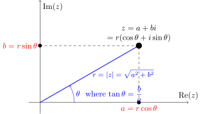

**Date: 09/10/2026**
 

This report documents the design, mathematical foundations, and programmatic implementation of an object-oriented Complex number arithmetic class in JavaScript.
A complex number extends the one-dimensional real coordinate system into a two-dimensional
plane (the complex plane, or Argand diagram), structured as:
$$z = a + bi \quad \text{where } a, b \in \mathbb{R} \text{ and } i^2 = -1$$

The implementation encapsulates state, coordinate transformations, fundamental arithmetic 
operations, and conjugate-based division.
 

### 1. A complex value $z$ can be represented in either Cartesian (Rectangular) or Polar coordinates.

For polar to cartesian coordinate transformation:
* **Transformation Equations:**

  $$a = r \cos(\theta)$$

  $$b = r \sin(\theta)$$

* **Final Cartesian Form:**

  $$z = r \cos(\theta) + i \big(r \sin(\theta)\big) = a + bi$$

For cartesian to polar coordinate transformation:
* **Modulus Squared ($r^2$):**

  $$|z|^2 = a^2 + b^2$$

* **Modulus / Magnitude ($r$):**

  $$|z| = \sqrt{a^2 + b^2}$$

* **Phase / Argument ($\theta$):**

  $$\theta = \operatorname{atan2}(b, a) \in (-\pi, \pi]$$

**Final Polar / Exponential Form (Euler's Formula):**

  $$z = r\big(\cos(\theta) + i \sin(\theta)\big) = r e^{i\theta}$$
   

### 2. Algebraic Operations (Addition and Subtraction)

Let two complex numbers in Cartesian rectangular form be defined as:

$$z_1 = a + bi \quad \text{and} \quad z_2 = c + di$$

where $a, b, c, d \in \mathbb{R}$ and $i^2 = -1$.

Addition and subtraction operate component-wise over the orthogonal real and imaginary axes independently.

* **Addition Formula:**

  $$z_1 + z_2 = (a + c) + (b + d)i$$

* **Subtraction Formula:**

  $$z_1 - z_2 = (a - c) + (b - d)i$$

* **Final Result Forms:**

  $$\operatorname{Re}(z_1 \pm z_2) = a \pm c$$

  $$\operatorname{Im}(z_1 \pm z_2) = b \pm d$$

  
---
 

**Date: 10/10/2026**
 

### 3. Multiplication

Multiplication corresponds to standard polynomial expansion (FOIL) evaluated under the imaginary identity $i^2 = -1$:

$$(a + bi)(c + di) = ac + adi + bci + bdi^2$$

Substituting $i^2 = -1$ and grouping terms along the orthogonal dimensions:

$$(a + bi)(c + di) = ac + adi + bci - bd = (ac - bd) + (ad + bc)i$$

* **Multiplication Formula:**

  $$z_1 \cdot z_2 = (ac - bd) + (ad + bc)i$$

* **Final Result Forms:**

  $$\operatorname{Re}(z_1 \cdot z_2) = ac - bd$$

  $$\operatorname{Im}(z_1 \cdot z_2) = ad + bc$$
   

### 4. Multiplication Scaling

Scaling modifies the vector magnitude by a real scalar factor $k \in \mathbb{R}$ while preserving its directional argument (or reversing it by $\pi$ radians if $k < 0$).

* **Scaling Formula:**

  $$k \cdot z = k(a + bi) = (k \cdot a) + (k \cdot b)i$$

* **Final Result Forms:**

  $$\operatorname{Re}(k \cdot z) = k \cdot a$$

  $$\operatorname{Im}(k \cdot z) = k \cdot b$$
 

### 5. Complex Conjugation

The complex conjugate reflects the coordinate across the real horizontal axis by negating the imaginary component.

* **Conjugation Formula:**

  $$\bar{z} = a - bi$$

* **Fundamental Norm Identity:**

  $$z \cdot \bar{z} = (a + bi)(a - bi) = a^2 - abi + abi - b^2i^2 = a^2 + b^2 = |z|^2$$

* **Final Result Forms:**

  $$\operatorname{Re}(\bar{z}) = a$$

  $$\operatorname{Im}(\bar{z}) = -b$$
 

### 6 Division

Direct division is rationalized by multiplying both the numerator and denominator by the complex conjugate of the denominator, $\bar{z}_2 = c - di$:

$$\frac{z_1}{z_2} = \frac{z_1 \cdot \bar{z}_2}{z_2 \cdot \bar{z}_2} = \frac{(a + bi)(c - di)}{(c + di)(c - di)}$$

Expanding both terms yields:

$$\text{Numerator: } (a + bi)(c - di) = (ac + bd) + (bc - ad)i$$

$$\text{Denominator: } (c + di)(c - di) = c^2 + d^2 = |z_2|^2$$

* **Division Formula:**

  $$\frac{z_1}{z_2} = \frac{(ac + bd) + (bc - ad)i}{c^2 + d^2} \quad \text{for } c^2 + d^2 \neq 0$$

* **Final Result Forms:**

  $$\operatorname{Re}\left(\frac{z_1}{z_2}\right) = \frac{ac + bd}{c^2 + d^2}$$

  $$\operatorname{Im}\left(\frac{z_1}{z_2}\right) = \frac{bc - ad}{c^2 + d^2}$$
